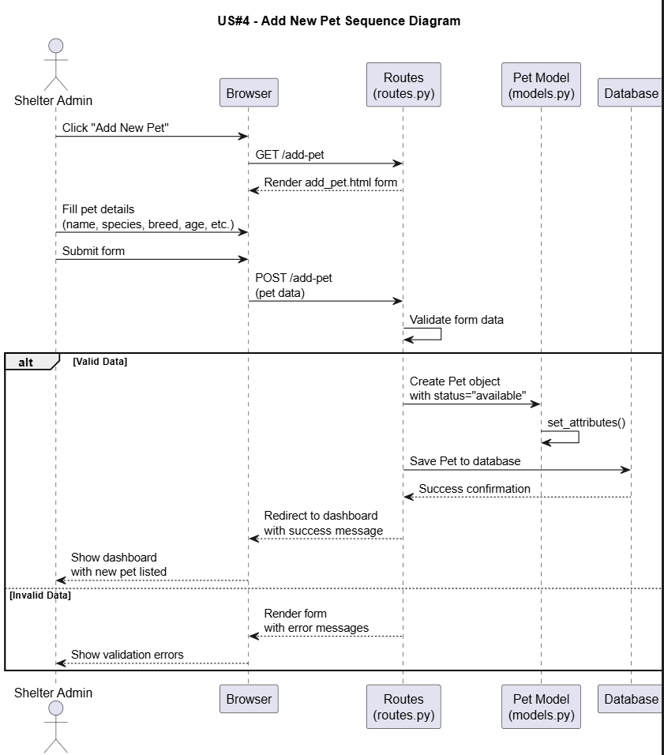
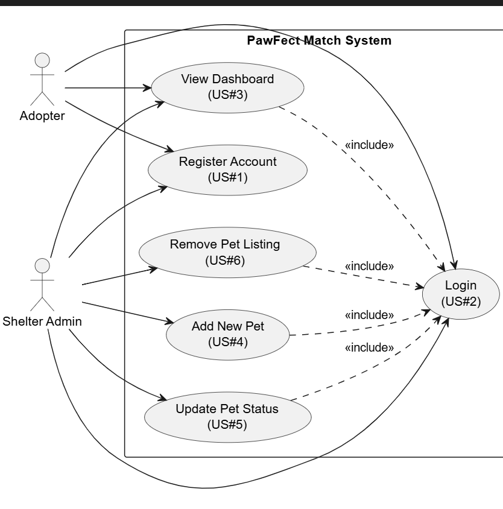
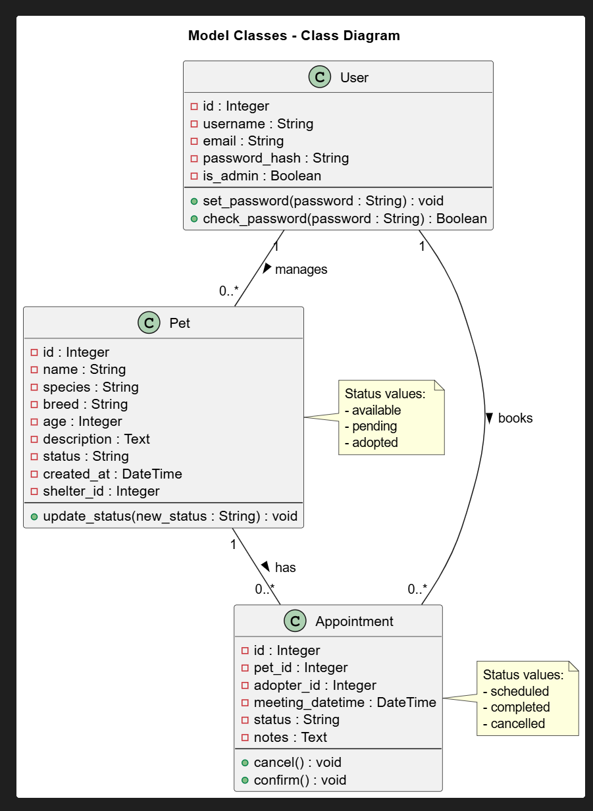

# Overview

**PawFect Match** is a web-based pet adoption platform designed to connect prospective pet owners with shelter animals. The application serves two distinct user types: shelter administrators who manage pet listings and availability, and potential adopters who browse pets and schedule visits.

Both shelter staff and prospective adopters can create accounts on the platform. Shelter administrators have elevated permissions to add new pets to the system, update their profiles, and change their adoption status (available, pending, adopted). Prospective adopters can browse the available pets, view detailed information about each animal, and reserve meeting times to visit pets they're interested in adopting.

Our target audience includes animal shelters and rescue organizations seeking an efficient online management system, as well as individuals and families looking to adopt pets through a streamlined digital platform.

# Design

## User Stories

Describe the **user stories** for the project, which are short, simple descriptions of a feature told from the perspective of the end user. Each **user story** should include clear **acceptance criteria** and a **point estimate**. The **user stories** must align with the **use case diagram** and should be labeled as US#1, US#2, and so on. We suggest creating a separate Markdown section for each **user story**. 

Use the following template when writing your **user stories**. 

User stories that need to be written up: Sign up, Authentication, Dashboard, Add and edit pet (just for admin), reserve meeting time, and removing pet when adopted.

```
As a [type of user], I want to [perform some task] so that I can [achieve some goal].

Given that [context], when [some action is carried out] then [a set of observable outcomes should occur].
```

## US #1 - User Authentication
As a new user, I want to create an account so that I can access platform features based on my role.
- Users can register with email, password, and user type (Admin or Adopter)
- Passwords are securely hashed
- Successful registration logs the user in and redirects to appropriate dashboard

## US #2 – User Login
As a registered user, I want to log into my account so that I can access my personalized dashboard.
- Users can log in with email and password
- Successful login redirects to role-appropriate dashboard (shelter vs adopter)
- Failed login shows  error message

## US #3 – View Shelter Dashboard
As a shelter administrator, I want to see an overview of my shelter's pets and status so that I can manage operations efficiently.

Dashboard shows:
- List of pets with their current status (available, pending, adopted)
- Easy access to "Add New Pet" functionality
- Each pet has edit/remove options

## US #4 – Add New Pet
As a shelter administrator, I want to add new pets to the system so that potential adopters can browse them.

- Shelter staff can access an "Add Pet" form
- Form includes: name, species, breed, age, description, etc.
- Pet is initially set to "available" status
- After successful addition, redirect to pet list or dashboard

## US #5 – Update Pet Status
As a shelter administrator, I want to update a pet's adoption status so that the platform reflects current availability.

- Shelter staff can change status between: available, pending, adopted
- Status changes are reflected immediately in the system

## US #6 – Remove Pet Listing
As a shelter administrator, I want to remove pets from the system so that adopted or transferred animals no longer appear.
- Remove button/option on pet management views
- Success message after removal


## Sequence Diagram

At least one **user story**, unrelated to user creation or authentication, must be detailed using a **sequence diagram**. A **sequence diagram** is a type of UML diagram that shows how objects interact in a particular scenario, emphasizing the order of messages exchanged between components over time. This helps visualize the flow of operations and the responsibilities of different parts of the system.

Used User story #4




## Model 

Include a **class diagram** that clearly describes the **model classes** used in the project and their associations. A **class diagram** is a UML diagram that represents the structure of the system by showing its classes, their attributes, methods, and the relationships between them (such as inheritance, aggregation, or composition). This helps visualize how the data and logic are organized within the application.





# Development Process 

This section should describe, in general terms, how Scrum was applied in the project. Include a table summarizing the division of the project into sprints, the **user story** goals planned for each sprint, the ones actually completed, and the start and end dates of each sprint. You may also add any relevant observations or reflections about the sprints as you see fit.

|Sprint#|Goals|Start|End|Done|Observations|
|---|---|---|---|---|---|
|1|US#1, US#2, Project Setup, User Stories, UML Diagrams|11/19/25|11/28/25|In Progress|Initial sprint focused on authentication and project foundation|
|2|US#3, US#4, US#5|11/29/25|12/05/25|Not Started|Dashboard and pet management features|
|3|US#6, Testing, Documentation, Deployment|12/06/25|12/09/25|Not Started|Final features, test coverage, Docker deployment|

As in Project 2, you should take notes on the major Scrum meetings: planning, daily scrums, review, and retrospective. These meetings are essential for tracking progress, identifying obstacles, and ensuring continuous improvement. Use the Scrum folder and the shared templates to record your notes in an organized and consistent manner.

Embed an image of the burndown chart here. 

# Testing 

In this section, share the results of the tests performed to verify the quality of the developed product, including the test coverage relative to the written code. Test coverage indicates how much of your code is exercised by tests, helping assess reliability. There is no minimum coverage requirement, but ensure there is at least some coverage through one white-box test (which examines internal logic and structure) and one black-box test (which validates functionality from the user’s perspective).